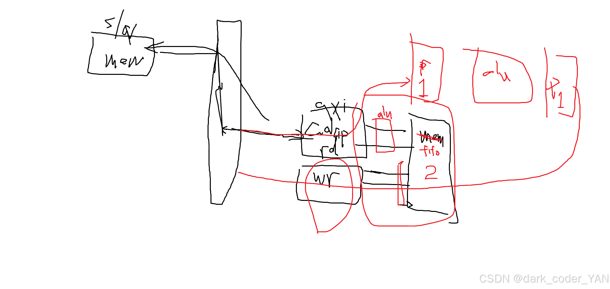

# <font color=#FF69B4> 2025/10/22 進度描述 </font>
- 重新複習一下picorv32 cup ports 的定義(搭配waveform)
- 了解 [pulp-platform-axi](https://github.com/pulp-platform/axi)，決定選用此模組與`picorv32`結合

  ## 結合想法:
  在先前的文章中，有手畫出
  https://blog.csdn.net/matthew8749/article/details/150404228?fromshare=blogdetail&sharetype=blogdetail&sharerId=150404228&sharerefer=PC&sharesource=matthew8749&sharefrom=from_link


# <font color=#FF69B4> 2025/10/27 進度描述</font>
完成cpu接上xbar

2025/10/30
了解二維記憶體空間(不連續)規格規格定義搭配axi-lite的讀寫控制
```
//        BASE_ADDR +----------------------------------------------------------------------------+
//                  |                                                                            |
//                  |           (IMP_SRC_BADDR)         CNST_PXL_WIDTH                           |
//                  |            CNST_PXL_X_STA +--------------------------+ CNST_PXL_X_END      |
//                  |                           |**************************|                     |
// iIMP_pxl_y_cur   |   processing this line -> |**************************|                     |
//                  |                           |**************************|                     |
//                  |                           |**************************|                     |
//                  |               xt_ycnt_end +--------------------------+                     |
//                  |                                                                            |
//                  +----------------------------------------------------------------------------+
```

# <font color=#FF69B4>2025/10/31 進度描述</font>
完成讀通道初步撰寫完成
debug中

# <font color=#FF69B4>2025/11/02 進度描述</font>
完成讀通道撰寫、debug完成 (axi_adapter_rd.sv)
下一步規劃寫一個無窮大頻寬的fifo
先規劃好axi_fifo的介面定義且設計成一個reuseable的模組 (很重要!! 好debug)
>2port 同時讀寫


# 2025/11/08 ~ 2025/11/11

feat(axi-lite): 新增記憶體與主通道模組並整合至 SoC
- 新增 AXI-Lite 記憶體模組 `axi_lite_memory.sv`。
- 新增 AXI-Lite 主通道模組 `mst_imp_r_ch.sv`、`mst_imp_w_ch.sv`。
- 更新 soc_top 檔案清單與 `picorv_x_pulp_soc.sv`，實例化並連接上述模組。
- 擴充 AXI slave 支援並調整位址對應（address mapping）。
- 修正 `axi4_memory_bhv.sv` 位址寬度處理邏輯。
- 微調 Makefile 相關模擬與組態選項。

為什麼：
- 提升 AXI-Lite 通道模組化與可重用性，支援多 slave 架構與 SoC 整合測試。

影響：
- 功能新增：SoC 具備 AXI-Lite master/slave 互連能力。
- 不影響既有模擬流程；需重新確認記憶體位址範圍設定。

測試計畫：
- 使用 `picorv_x_pulp_soc 頂層`進行 AXI-Lite 讀寫模擬。
- 驗證多 slave 位址對應與通道握手（read/write channel handshake）正確性。

在axi_lite_memory.sv在讀操作(AW、W)的時候，
原本希望讓timing好一點
所以多敲了兩級flip-flop in 、flip-flop out ，
但是這樣效率會面很差，頻寬是下原來的1/5


# 2025/11/12 `axi_lite_regs.sv`
## control register
1. AXI-Lite 介面信號行為（AW, W, B, AR, R 五通道 handshake）。
2. PULP `addr_decode.sv` 和 `spill_register.sv` 功能。
3. 巨集 `FFLARN` 與 `AXI_LITE_TYPEDEF_*`。
4. 嘗試寫一個精簡版（不支援 read-only / prot，只支援基本 R/W）。


在配置reg file時，要先想到:
對哪些訊號進行設定


### event語法
event       print_ok;
-> print_ok;


## apb_subsystem和interface整理

從apb bus 上給出的apb_req_o(也就是要接上apb slave的)


```verilog
  assign paddr_o   = apb_req[apb_sel].paddr;
  assign pprot_o   = apb_req[apb_sel].pprot;
  assign penable_o = apb_req[apb_sel].penable;
  assign pwrite_o  = apb_req[apb_sel].pwrite;
  assign pwdata_o  = apb_req[apb_sel].pwdata;
  assign pstrb_o   = apb_req[apb_sel].pstrb;
  for (genvar i = 0; i < NoApbSlaves; i++) begin : gen_apb_resp_assign
    assign pselx_o[i]          = apb_req[i].psel;
    assign apb_resp[i].pready  = pready_i[i];
    assign apb_resp[i].prdata  = prdata_i[i];
    assign apb_resp[i].pslverr = pslverr_i[i];
  end

onehot_to_bin #(
  .ONEHOT_WIDTH                   ( NoApbSlaves  )
) i_onehot_to_bin (
  .onehot                         ( pselx_o      ),
  .bin                            ( apb_sel      )
);
```


# APB code 解釋
## apb_reg.sv
### 參數定義
參數 (Parameters)：

- **`NoApbRegs` :** 暫存器的數量。

- **`ApbAddrWidth` :** `req_i.paddr` 的位址寬度，用於生成內部位址映射。

- **`AddrOffset` :** 暫存器之間的位址偏移量 (以位元組為單位)。此值斷言 (asserted) 至少為 32'd4，原因是為了防止位址映射重疊。每個暫存器映射到 4 位元組寬的位址範圍。當此參數大於 32'd4 時，位址映射中將會出現空洞，模組將回應 `apb_pkg::RESP_SLVERR`。建議此值為 2 的冪次，以防止上游匯流排出現資料對齊問題。
簡單來說就是 ==`AddrOffset`代表每個暫存器在記憶體位址上佔據了多大的範圍。==
  ```
  EX:
  base_addr_i = 0x1000 (基底位址)
  AddrOffset = 4
  暫存器 0 : 0x1000 + (0 × 4) = 0x1000
  暫存器 1 : 0x1000 + (1 × 4) = 0x1004
  暫存器 2 : 0x1000 + (2 × 4) = 0x1008
  暫存器 3 : 0x1000 + (3 × 4) = 0x100C
  ```

- **`ApbDataWidth` :** APB4 匯流排的資料寬度，此值最大可為 32'd32 (位元)。

- **`RegDataWidth` :** 暫存器的資料寬度，此值必須小於或等於 `ApbDataWidth`。如果小於該值，則讀取時暫存器會進行補零擴展 (zero extended)，寫入時較高位元將被忽略。

- **`ReadOnly` :** 此旗標可指定陣列中給定暫存器索引處為唯讀暫存器。當陣列中對應的位元被設置時，可以讀出給定索引處的 `reg_init_i` 訊號。如果設置了旗標，則寫入會被忽略。

- **`req_t` :** APB4 請求結構體 (struct)。參見 include/typedef.svh 中的巨集定義。

- **`resp_t` :** APB4 回應結構體 (struct)。參見 include/typedef.svh 中的巨集定義。

埠 (Ports)：

- **`pclk_i` :** 時脈輸入訊號 (1-bit)。

- **`preset_ni` :** 非同步低電位作動重置訊號 (1-bit)。

- **`req_i` :** APB4 請求結構體，捆綁來自 master 的所有 APB4 訊號 (req_t)。

- **`resp_o` :** APB4 回應結構體，捆綁傳送至 master 的所有 APB4 訊號 (resp_t)。

- **`base_addr_i` :** 此模組的基底位址，暫存器 0 從此處開始映射，索引為 0。所有後續較高索引的暫存器其基底映射為此值加上 reg_index * AddrOffset (ApbAddrWidth-bit)。

- **`reg_init_i` :** 每個暫存器的初始值，當暫存器索引配置為 ReadOnly[reg_index] == 1'b1 時，此值會直接傳遞至 APB4 匯流排 (陣列大小 NoApbRegs * RegDataWidth-bit)。

- **`reg_q_o` :** 暫存器的當前值。如果陣列索引處的暫存器是唯讀的，則 reg_init_i 的值會被傳遞至相應的索引 (陣列大小 NoApbRegs * RegDataWidth-bit)。


# Clock Divider

switch clk
step1. close clk_A(disable)
step1. set new div_val && open clk_A(enable)
step2. assert tog